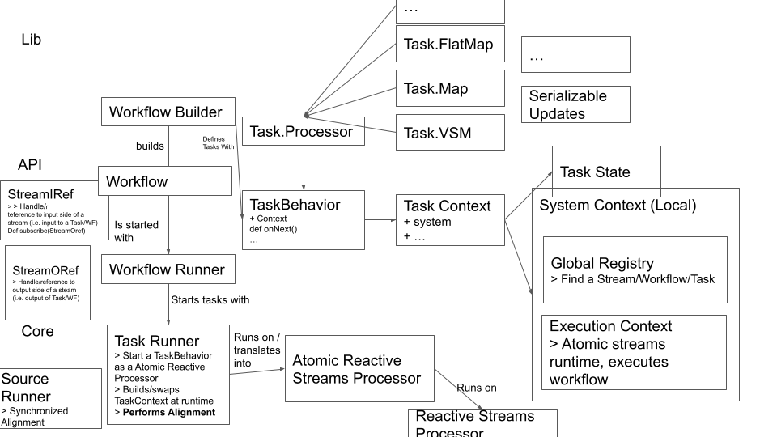

# Implementation
The prototype system consists of two layers.
* At the core we have Atomic Reactive Streams.
* On a higher level we have Workflows and Tasks (spanning the Api and Lib).

The glue between these two is the `SystemContext` which manages the `ExecutionContext`, and the `TaskRunner` which translates tasks into Atomic Reactive Streams.

We chose to explain the concepts from a bottom-up approach, starting with the system context.
This figure should add some additional guidance on the parts and how they are connected.

## System Context
The `SystemContext` holds the `ExecutionContext` and some `GlobalRegistry` where workflows and tasks are registered and can be recovered by name.

## Atomic Reactive Streams
The core consists of `AtomicStreams` (Atomic Reactive Streams). Atomic Streams implement a reactive streams system with: `Processor`s; `Subscriber`s; `Publisher`s; `Subscription`s, together with `Atom`s. Although not natively suppoorted by the Reactive Streams spec, the Atomic Streams support multi-publishers and multi-subscribers. Fault-tolerance will be added later for the distributed execution.

## Task Runner and Workflow Runner
The `TaskRunner` translates `TaskBehavior`s into `AtomicProcessor`s. The TaskRunner also implements handling alignment. The `TaskRunner` is triggered by the `WorkflowRunner`.

## Tasks
A task is defined by its `TaskBehavior`. 
The TaskBehavior consists of four methods: `onNext`, `onError`, `onComplete`, `onAtomComplete`.
The `TaskBehavior` has access to some `TaskContext`. The `TaskContext` contains the actions that the behavior can perform, this includes accessing the `TaskState`.

A `TaskProcessor` is a standard `TaskBehavior`, which in turn is used to implement other expected types of behavior such as `Map`, `FlatMap`, etc.

## Workflows
A workflow consists of tasks, sources, sinks, and the way in which they are connected.

The `WorkflowBuilder` can be used to build a workflow in a convenient API.
This is then translated to a `Workflow` description, and submitted for execution by the `WorkflowRunner`.

A workflow also has a `WorkflowManager` that synchronizes the sources, etc.

## Serializable Updates
Are implemented on a high-level wrapping the behaviors. TaskBuilders allow for modifying the behavior of a task in a useful way.

## StreamIRef StreamORef
TaskBehaviors are oblivious to any notions of Reactive Streams or Workflows. TaskBehaviors may access a `StreamIRef` and `StreamORef` object. These can be communicated with other tasks to allow for dynamic communication, and dynamic connections can be created during runtime.
